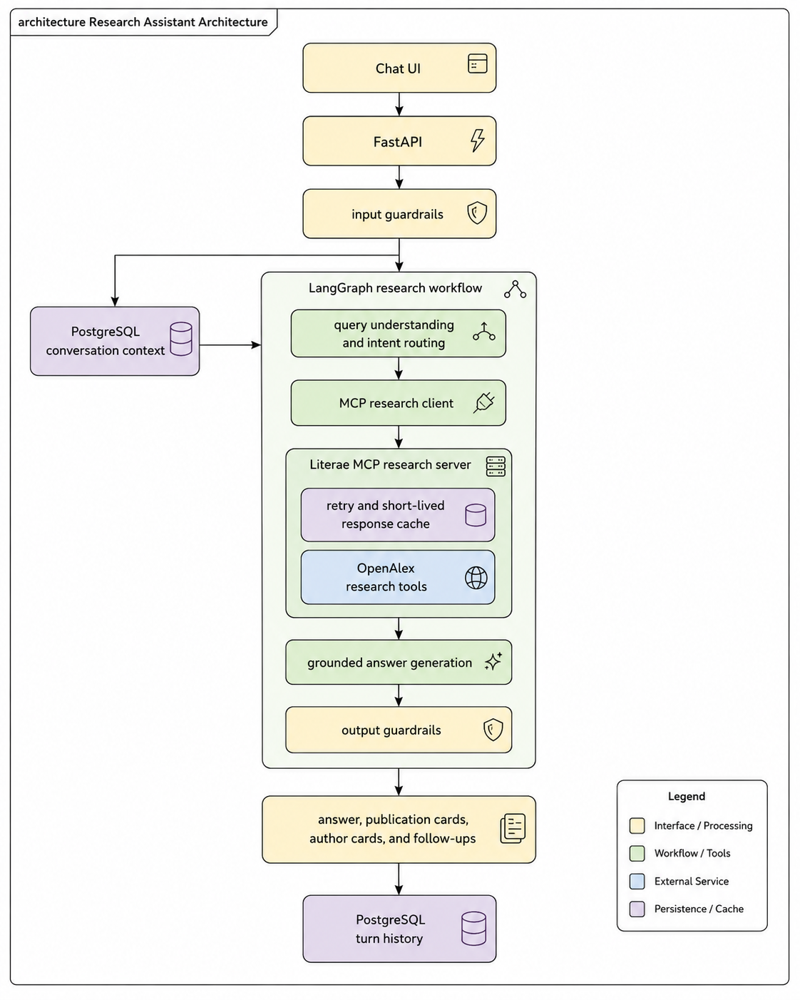

# Literae architecture

## MCP research tools

The graph does not call OpenAlex directly. It uses the official MCP Python SDK with an in-process
transport. This preserves MCP tool discovery and structured tool calls without adding a network hop
inside the API process. The same server can later be exposed over Streamable HTTP.

The server currently exposes:

- `search_publications`
- `search_authors`
- `get_author_works`
- `get_work_details`
- `find_related_works`
- `get_citing_works`
- `get_referenced_works`

OpenAlex remains the data provider behind these tools. LangGraph selects `get_author_works` for an
author-publications intent, `search_authors` for researcher profiles, and `search_publications` for
topic discovery. Follow-up transformations reuse the conversation's current publications without
performing another search.

## Persistence and resilience

PostgreSQL stores conversations and complete turn payloads so that the API can restore the latest
research context after a restart. The history repository is isolated behind an interface and can be
disabled for ephemeral deployments.

Transient OpenAlex failures are retried with exponential backoff. Successful retrieval responses
are cached in memory for a short configurable period, reducing repeated upstream requests within an
API process. This cache is intentionally disposable; a shared Redis cache is a future scaling step.
