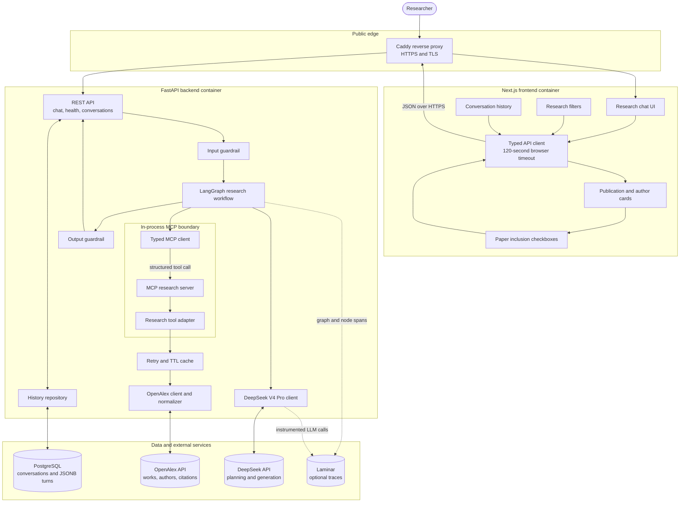
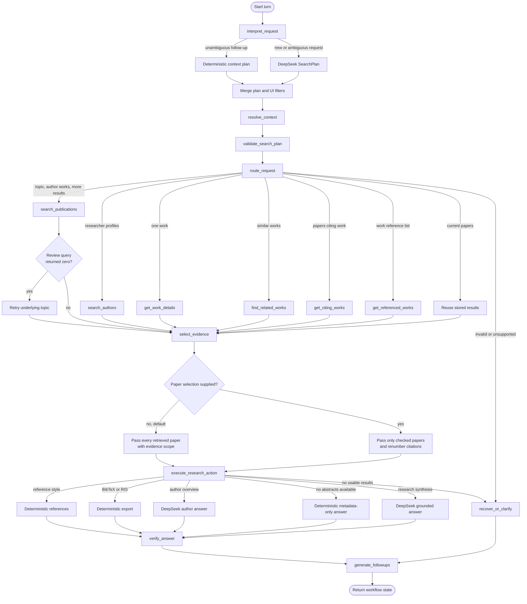
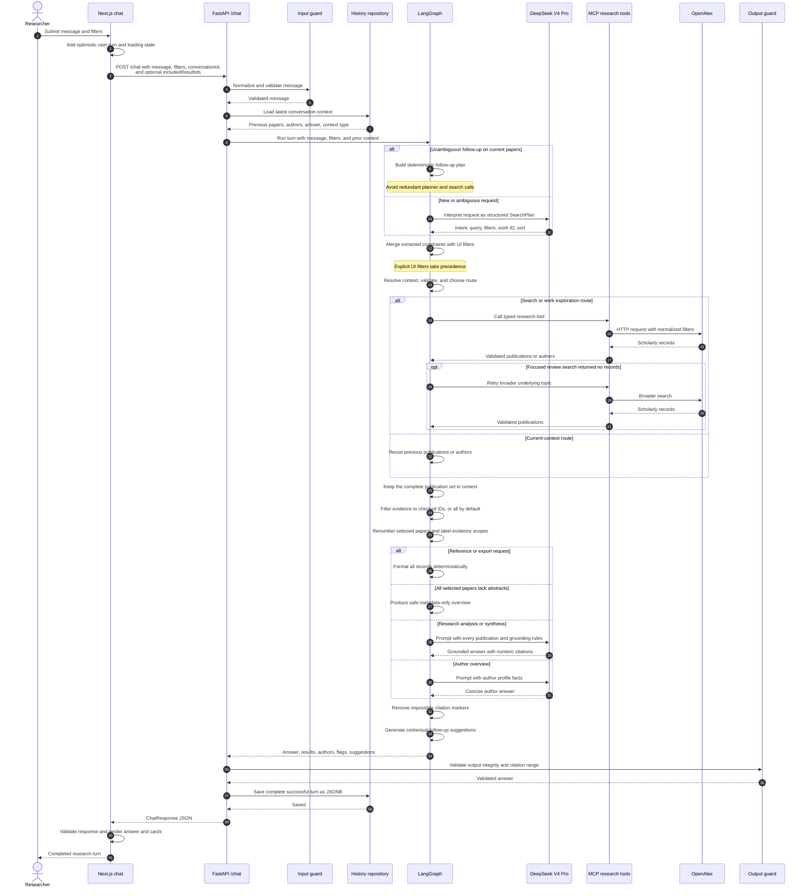
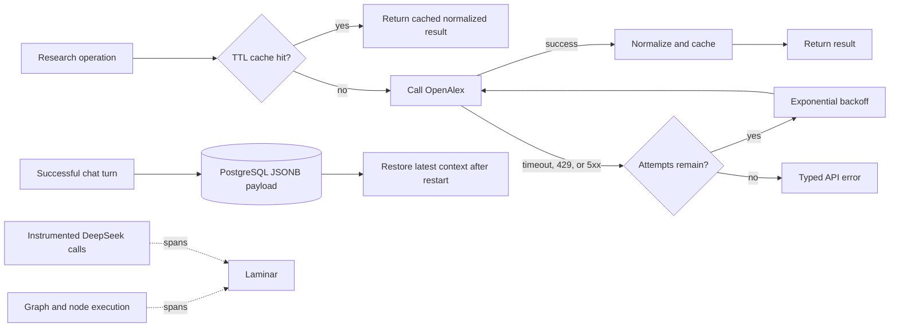

# Literae architecture

This document describes the active runtime architecture and the complete lifecycle of a chat turn.

## System and deployment architecture

In production, Caddy, Next.js, FastAPI, and PostgreSQL run as separate Docker Compose services.
MCP is in process: it preserves a typed, discoverable tool boundary without adding another network
hop. The same MCP server can also run independently over standard input/output.

## LangGraph workflow

The `ResearchState` carries the message, merged filters, structured plan, search query, page,
publications, authors, previous answer, route, visibility flags, context type, and suggestions. The
graph uses an in-memory LangGraph checkpointer keyed by conversation ID. PostgreSQL separately
provides durable restoration after a backend restart.

## Complete chat-turn sequence

## Routing behavior

| Intent or request | Route | External research call | Answer path |
| --- | --- | --- | --- |
| Topic search | Publication search | `search_publications` | DeepSeek synthesis |
| More papers | Next search page | `search_publications` | DeepSeek synthesis |
| Author's publications | Author-filtered works | `get_author_works` | DeepSeek synthesis |
| Author profile or metrics | Author search | `search_authors` | DeepSeek author answer |
| Work details | One work | `get_work_details` | DeepSeek synthesis |
| Related works | Related-work lookup | `find_related_works` | DeepSeek synthesis |
| Citing works | Citation lookup | `get_citing_works` | DeepSeek synthesis |
| Referenced works | Reference lookup | `get_referenced_works` | DeepSeek synthesis |
| Compare or summarize current papers | Context reuse | None | DeepSeek synthesis |
| Format references | Context reuse | None | Deterministic formatter |
| BibTeX or RIS | Context reuse | None | Deterministic exporter |
| Unsupported or invalid request | Recovery | None | Deterministic recovery |

## Evidence and grounding

By default, every retrieved publication is passed into research generation. When the user changes
the selection, every selected publication is passed instead. Before serialization, each record is
assigned one of two scopes:

- `abstract_and_metadata`: the model may make paper-specific claims supported by that paper's
  abstract or explicit metadata.
- `metadata_only`: the model may mention bibliographic fields, title, and indexed topics, but may not
  infer methods, findings, locations, arguments, or conclusions.

If every selected paper is metadata-only, the graph bypasses generation and returns a deterministic
overview explaining that abstracts or full text are required for substantive analysis. References and
exports use all selected publications and never depend on the model.

By default, every current publication is selected. The user can uncheck papers on the active result
cards. Follow-up requests send the checked OpenAlex IDs as `includedResultIds`; LangGraph filters the
analysis evidence and deterministic exports to that subset while retaining the complete result set in
conversation history. Checked papers are renumbered in result order so answer citations continue to
match the visible cards. At least one paper always remains selected.

## Reliability, persistence, and observability

The browser aborts a chat request after 120 seconds. FastAPI translates validation, OpenAlex,
DeepSeek, timeout, and output-integrity failures into typed HTTP responses. Only successful turns are
written to history.
